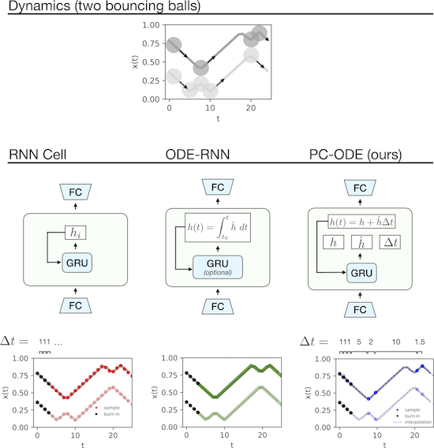

Piecewise-linear Neural ODEs
=======
Sam Greydanus, Stefan Lee, Alan Fern | 2021

Run in your browser
--------

* Lines experiment ([make dataset](https://colab.research.google.com/drive/11Erg10kBjoaM_92VW7myeDUOZILeLiU0?usp=sharing)) ([train all](https://colab.research.google.com/drive/1H70_ooQcqEvDobfVdCvS1rXX8skfnBW_?usp=sharing)) ([analysis](https://colab.research.google.com/drive/1pKHhqE7DxmECx5JUppvzAHf3N5_2-FSR?usp=sharing))
* Circles experiment ([make dataset](https://github.com/greydanus/piecewise_node/blob/main/billiards.py)) ([train jumpy](https://colab.research.google.com/drive/1hWFZvrHSz9YHYGnz7l4BNIRhguufyxWT?usp=sharing), [train baseline](https://colab.research.google.com/drive/1EJsMsullDM73OoL-x7gVTyLNFjblWm7K?usp=sharing)) ([analysis](https://colab.research.google.com/drive/1pKHhqE7DxmECx5JUppvzAHf3N5_2-FSR?usp=sharing))
* Billiards1D experiment ([make dataset](https://github.com/greydanus/piecewise_node/blob/main/billiards.py)) ([train jumpy](https://colab.research.google.com/drive/1Rgo8Sy1F_IOrX-3ePUrukxXhz9GrfB3M?usp=sharing), [train baseline](https://colab.research.google.com/drive/1KbBnBW2dC7fnn5I5qd2c2kqaJYslST1k?usp=sharing)) ([analysis](https://colab.research.google.com/drive/1pKHhqE7DxmECx5JUppvzAHf3N5_2-FSR?usp=sharing))
* Billiards2D experiment ([make dataset](https://github.com/greydanus/piecewise_node/blob/main/billiards.py)) (train jumpy) (train baseline) ([analysis](https://colab.research.google.com/drive/1pKHhqE7DxmECx5JUppvzAHf3N5_2-FSR?usp=sharing))
* PixelBilliards1D experiment ([make dataset](https://colab.research.google.com/drive/1PnWvOkYt3OiS5vxb1fMhOuCMmWjK6gjz?usp=sharing)) (train jumpy) (train baseline) ([analysis](https://colab.research.google.com/drive/1khovLXxgteMUQpvTfpz7NxKbClGHJ9jO?usp=sharing))
* PixelBilliards2D experiment ([make dataset](https://colab.research.google.com/drive/1XnJm_WmNYzx05XZCJ1o5BqGSlwBdZvrg?usp=sharing)) (train jumpy) (train baseline) ([analysis](https://colab.research.google.com/drive/1khovLXxgteMUQpvTfpz7NxKbClGHJ9jO?usp=sharing))

Summary
--------
Neural networks are a popular tool for modeling sequential data but they generally do not treat time as a continuous variable. Neural ODEs represent an important exception: they parameterize the time derivative of a hidden state with a neural network and then integrate over arbitrary amounts of time. But these parameterizations, which have arbitrary curvature, can be hard to integrate and thus train and evaluate. In this paper, we propose making a piecewise-constant approximation to Neural ODEs to mitigate these issues. Our model can be integrated exactly via Euler integration and can generate autoregressive samples in 3-20 times fewer steps than comparable RNN and ODE-RNN models. We evaluate our model on several synthetic physics tasks and a planning task inspired by the game of billiards. We find that it matches the performance of baseline approaches while requiring less time to train and evaluate.

Dependencies
--------
 * NumPy
 * SciPy
 * PyTorch
 * Matplotlib